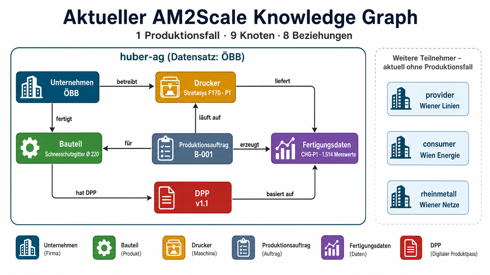

# AM2Scale — Dataspace-POC

Proof of Concept für einen **souveränen Datenraum für die additive Fertigung**.
Mehrere Unternehmen teilen Bauteil-, Prozess- und Qualitätsdaten miteinander —
jedes entscheidet selbst, **wer** was sehen und beziehen darf. Technische Basis
ist der [Eclipse Dataspace Connector](https://github.com/eclipse-edc) (Fork des
[Minimum Viable Dataspace](https://github.com/eclipse-edc/MinimumViableDataspace));
das Deployment läuft als Docker-Compose-Stacks unter Podman.



## Stand: August 2026

Branch `feat/compose-dataspace`. Lauffähig und demonstrierbar:

| | Was funktioniert |
|---|---|
| **Deployment** | Compose-Stacks statt Kubernetes; ein Stack pro Unternehmen, Zustand in benannten Volumes, übersteht Rechner-Neustarts |
| **Onboarding** | Neues Unternehmen per Web-UI oder CLI in 1–2 Minuten voll teilnahmefähig (Keypair, DID, Credentials vom Issuer, Katalog) |
| **Portal** | Multi-Tenant-UI mit Keycloak-Login; Kataloge durchsuchen, Assets hochladen, Daten per Klick beziehen (Negotiation → Agreement → Transfer → EDR → Download) |
| **Qualitätsdaten** | Gerichteter Rückfluss: Bericht ist per DID-Policy **nur** für den ursprünglichen Anbieter sichtbar |
| **Rollen & Level** | Zwei Dimensionen — Firmenbeziehung (fremd/Partner/Tochter) × Personen-Level (Leiter/Arbeiter) |
| **Knowledge Graph** | 113 Knoten aus dem echten AM2Scale-Datensatz, 9 Entitätstypen, Attribute einzeln nach Tier klassifiziert |
| **Suche** | Semantische Vektorsuche (offline, model2vec) getrennt von strukturierten Filtern; jeder Treffer attributweise auf das Level des Betrachters beschnitten |

**Bekannte Provisorien:** Portal, Discovery, Docs und Onboarding laufen als Host-Prozesse
(nicht containerisiert); alle Passwörter sind Demo-Werte (`password`, Vault-Token
`root`, Keycloak `admin/admin`); Vault entsiegelt sich selbst mit dem Key aus dem
Volume; die Semantik-Freitexte in `data/material-semantik.json` sind Platzhalter
und sollten durch echte Angaben ersetzt werden.

## Teilnehmer

Sieben Teilnehmer in drei Organisationsgruppen. Jeder ist ein vollwertiger
EDC-Connector mit eigener DID, eigenem Katalog und eigener Dateiablage; die
Spalte *Datensatz* nennt das Unternehmen aus `AM2Scale_Mini_Datensatz_erweitert.xlsx`,
das der Teilnehmer im Knowledge Graph verkörpert.

| Teilnehmer | Anzeigename | Datensatz | KG-Knoten | Rolle |
|---|---|---|---|---|
| `wiener-stadtwerke` | Wiener Stadtwerke | — (synthetisch) | 1 | Konzernholding |
| `wiener-linien` | Wiener Linien | U2 WienerLinien | 6 | Tochter |
| `wien-energie` | Wien Energie | U3 WienEnergie | 1 | Tochter |
| `wiener-netze` | Wiener Netze | U4 WienerNetze | 1 | Tochter |
| `oebb` | ÖBB | U1 ÖBB Wien | 6 | Konzern |
| `fha-wien` | Fraunhofer Austria Wien | U6 (3 Drucker) | 86 | Forschung |
| `fha-tirol` | Fraunhofer Austria Tirol | U7 (1 Drucker) | 12 | Forschung |

**Beziehungen** (jeder Eigentümer stuft die anderen ein — 1 fremd · 2 Partner ·
3 Tochter, gespeichert in `compose/companies/<name>/relationships.json`):

- konzern-intern volle Freigabe: Wiener Stadtwerke ↔ Linien/Energie/Netze und
  die Schwestern untereinander, ebenso FHA Wien ↔ FHA Tirol → **3**
- alle gruppenübergreifenden Paare → **2** (Partner)

> Damit ist derzeit **kein Paar auf „fremd" (1)** gesetzt — der Kontrast
> „fremd sieht nur T1" lässt sich also nur zeigen, indem man eine Stufe im
> Portal-Tab „Verwaltung" herabsetzt.

Nur U6 und U7 besitzen Drucker, deshalb liegt die gesamte Produktionskette
(Fertigungsaufträge, Bauteile, Qualitätsprüfungen, Maschinendaten) bei den beiden
Fraunhofer-Standorten. Die ERP-Tabelle enthält vier Materialien; sie werden
gleichmäßig verteilt und landen bei `fha-wien`, `fha-tirol`, `oebb` und
`wiener-linien`. Wien Energie, Wiener Netze und die Holding treten daher als
reine Datenbezieher auf. Mapping und Standort-Korrekturen stehen in
[ui/discovery/import_dataset.py](ui/discovery/import_dataset.py)
(`DEFAULT_MAPPING`, `COMPANY_OVERRIDES`, `SYNTHETIC_FIRMS`) — `fha-tirol` spielt
U7, das der Datensatz als Standort Graz führt, und wird dort auf Innsbruck
umgestellt.

## Schnellstart

Voraussetzungen: **Podman** (Machine `podman-machine-default` initialisiert),
**Python 3.11+** mit `pip install model2vec numpy openpyxl`, **JDK 17+** für den
einmaligen Image-Build.

```powershell
cd compose
.\build-images.ps1          # einmalig: Controlplane-/Dataplane-Images bauen
cd ..
.\start.ps1                 # Stacks + Discovery + Portal + Docs in einem Rutsch
```

Danach [http://127.0.0.1:5180](http://127.0.0.1:5180) öffnen, Login z. B.
`fha-wien` / `password`. Nach einem Rechner-Neustart genügt `.\start.ps1` — alle
Daten (Assets, Verträge, Identitäten, Secrets) sind noch da.

Den Knowledge Graph aus dem Datensatz aufbauen (Discovery muss laufen):

```powershell
python ui\discovery\import_dataset.py --all
```

## Skripte

Alles unter `compose/`, plus ein Sammel-Skript im Root:

| Skript | Zweck | Wann |
|---|---|---|
| `start.ps1` | Stacks + Discovery + Portal + Docs zusammen hochfahren | **der Normalfall** |
| `compose/build-images.ps1` | `mvd-controlplane-local` / `mvd-dataplane-local` bauen | einmalig, und nach Java-Änderungen unter `launchers/` oder `extensions/` |
| `compose/start-dataspace.ps1` | nur die Podman-Stacks (Infra + alle Firmen) | wenn man die UIs nicht braucht |
| `compose/start-discovery.ps1` | Discovery-Service, KG + Vektorsuche (`:5185`) | wird vom Portal benötigt |
| `compose/start-portal.ps1` | Dataspace-Portal (`:5180`) | die Haupt-UI |
| `compose/start-docs.ps1` | Dokumentationsdienst (`:5190`) | Handbuch und alle technischen Dokus |
| `compose/start-onboarding.ps1` | Onboarding-/Registry-UI (`:5175`) | nur zum Anlegen neuer Firmen |
| `compose/new-company.ps1` | dasselbe per CLI: `.\new-company.ps1 -Name mueller-gmbh` | Alternative zur Onboarding-UI |

`start.ps1` kennt `-StacksOnly` (ohne Host-UIs) und `-WithOnboarding`.

## Architektur

```
Netzwerk "dataspace" (Podman, geteilt)
│
├── Stack mvd-infra        compose/infra/
│     traefik :80          Routing für alle *.localhost-Hostnamen
│     postgres             geteilt, eine DB pro Firma + keycloak + issuerservice
│     keycloak             Realm "mvd" — Personen, Firma & Level als Attribut
│     vault                Secrets, Auto-Unseal
│     issuerservice        stellt Membership-/Manufacturer-Credentials aus
│
├── Stack mvd-<firma>      compose/company/ + companies/<firma>/.env
│     controlplane         EDC + IdentityClaimMapperExtension (DID → Policy-Engine)
│     dataplane            EDC + KeySeedExtension (Keypair in Vault)
│     identityhub          DID-Dokument, Credentials, Presentation-Flow
│     filestore            nginx über companies/<firma>/storage/assets
│     seed-*               One-Shots: DB, Vault, Identität, Assets/Policies
│
└── Host-Prozesse (noch nicht containerisiert)
      portal    :5180      Multi-Tenant-UI
      discovery :5185      Knowledge Graph + Vektorsuche
      docs      :5190      Dokumentation + eigene API
      onboarding:5175      Registry + Anlegen neuer Firmen
```

Zugriff wird **zweifach** durchgesetzt: das Portal/Discovery filtert nach
`Tier ≤ min(Firmenbeziehung, Personen-Level)`, und der EDC prüft davon unabhängig
kryptografisch die Credentials (Mitgliedschaft, ggf. Empfänger-DID). Discovery
zeigt also potenziell mehr, als man beziehen kann — auffindbar ≠ zugänglich.

Details zu Namensschema, Traefik-Routen, Portainer-Deployment und Troubleshooting:
**[compose/README.md](compose/README.md)**.

## Endpunkte

| Dienst | URL |
|---|---|
| Portal | `http://127.0.0.1:5180` (Login `<firmenname>` / `password`) |
| Discovery | `http://127.0.0.1:5185` |
| Dokumentation | `http://127.0.0.1:5190` (API: `/api/docs`, `/api/search?q=`, `/api/health`) |
| Onboarding | `http://127.0.0.1:5175` |
| Management-API einer Firma | `http://cp.<name>.localhost/api/mgmt` (Header `X-Api-Key: password`) |
| Dataplane Public | `http://dp.<name>.localhost/public/api/public` |
| DID-Dokument | `http://identityhub-<name>:7083/<name>/did.json` — **nur containerintern**, siehe Hinweis unten |
| Keycloak | `http://keycloak.localhost` (`admin/admin`) |
| IssuerService | `http://issuer.localhost` |
| Vault | `http://vault.localhost` (Token `root`) |

> **DID-Dokumente sind von außen nicht abrufbar.** Der IdentityHub liefert das
> Dokument passend zum `Host`-Header der Anfrage, und die DIDs lauten
> `did:web:identityhub-<name>%3A7083:<name>` — also auf den *internen* Hostnamen.
> Über `http://ih.<name>.localhost/...` antwortet er deshalb mit `204 No Content`.
> Zum Nachschauen aus dem Netz heraus:
> `podman run --rm --network dataspace curlimages/curl -s http://identityhub-<name>:7083/<name>/did.json`.
> Für die DSP-Kommunikation ist das ohne Belang — die Teilnehmer lösen einander
> containerintern auf. Erst beim Portainer-Deployment mit echten Hostnamen müssen
> DID und Traefik-Route zusammenpassen.

## Repo-Struktur

| Pfad | Inhalt |
|---|---|
| `compose/` | Deployment: Infra-Stack, Firmen-Template, Onboarding-Service, alle Skripte |
| `compose/companies/<name>/` | pro Firma: `.env`, `company.json`, `relationships.json`, `storage/` (Assets + Downloads, im Explorer sichtbar) |
| `ui/portal/` | Dataspace-Portal (Python stdlib + Vanilla JS, keine Build-Kette) |
| `ui/discovery/` | Discovery-Service, KG-Schema, `import_dataset.py`, `export_neo4j.py` |
| `ui/docs/` | Dokumentationsdienst; `content/handbuch.md` ist das Anwenderhandbuch |
| `launchers/` | EDC-Runtimes; `controlplane` und `dataplane` enthalten eigene Extensions und werden lokal gebaut, `identity-hub`/`issuerservice` kommen als Image von ghcr.io |
| `extensions/` | Runtime-Abhängigkeiten der Launcher (Dataplane Public API v2, Dataplane-Registrierung) |
| `data/` | Quelldatensatz `AM2Scale_Mini_Datensatz_erweitert.xlsx`, Semantik-Anreicherung, Demo-Foto |
| `exports/` | fertige Neo4j-Cypher-Exporte des KG je Level |
| `docs/` | Projektdoku, siehe unten |
| `Requests/` | Bruno-Collection gegen die Management-APIs |
| `tests/end2end/` | EDC-E2E-Tests aus dem Upstream (laufen nicht gegen das Compose-Setup) |

## Dokumentation

**Für Anwender:** das [Anwenderhandbuch](ui/docs/content/handbuch.md) — anmelden,
Daten finden, beziehen, anbieten, Zugriffsstufen verwalten, Fehlerbehebung. Ohne
technische Vorkenntnisse lesbar; der richtige Einstieg für Demo-Teilnehmer und
Projektpartner.

Am bequemsten über den **Docs-Dienst**, der alle Dokumente hier gebündelt
ausliefert — inklusive Volltextsuche und Querverweisen:
`http://127.0.0.1:5190` (läuft mit `.\start.ps1` automatisch mit, oder einzeln
über `compose\start-docs.ps1`).

**Für Entwickler:** die folgenden Notizen, chronologisch, jeweils mit Stand und verifizierten Beispielen:

1. [Compose-Migration](docs/UPDATE-2026-07-Compose-Migration.md) — weg von Kubernetes
2. [Phase 4: Qualitätsdaten-Rückfluss](docs/UPDATE-2026-07-Phase4-Qualitaetsdaten.md) — gerichtete DID-Policies
3. [Phase 5: Rollen & Level](docs/UPDATE-2026-07-Phase5-Rollen-Level.md) — Firmenbeziehung × Personen-Level
4. [Phase 6: Vektorsuche](docs/UPDATE-2026-07-Phase6-Vektorsuche.md) — level-restriktierte Discovery
5. [KG aus dem Dataset](docs/UPDATE-2026-08-KG-aus-Dataset.md) — Schema aus echten Daten
6. [KG v3: Suche und Filter](docs/UPDATE-2026-08-KG-v3-Suche-und-Filter.md) — **aktueller Stand**
7. [Neo4j-Visualisierung](docs/NEO4J-Visualisierung.md) — KG als Cypher exportieren und anschauen
8. [POC-Plan](docs/AM2Scale-Dataspace-POC-Plan.pdf) — ursprüngliche Planung

## Herkunft

Fork des [Eclipse MinimumViableDataspace](https://github.com/eclipse-edc/MinimumViableDataspace)
(Apache 2.0, siehe [LICENSE](LICENSE)). Der Upstream-Stand samt K8s-Deployment und
der originalen englischen Dokumentation liegt in der Git-History (bis Commit
`d551e18`) und unter `remotes/upstream/main`.
